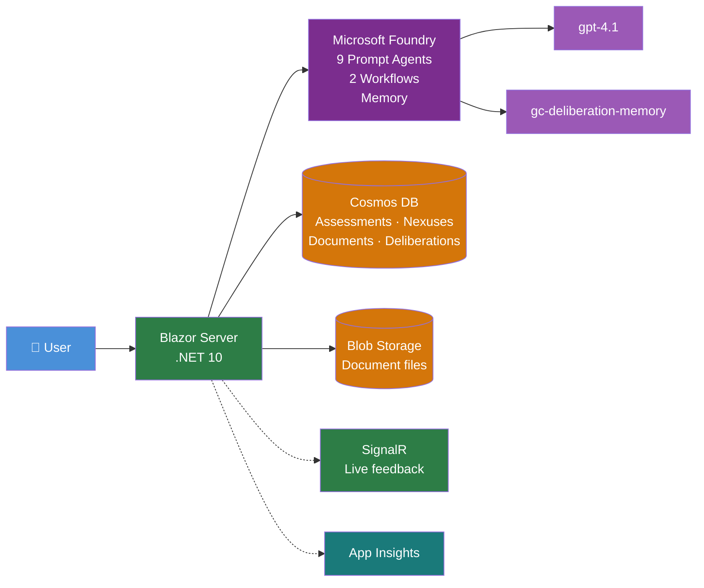
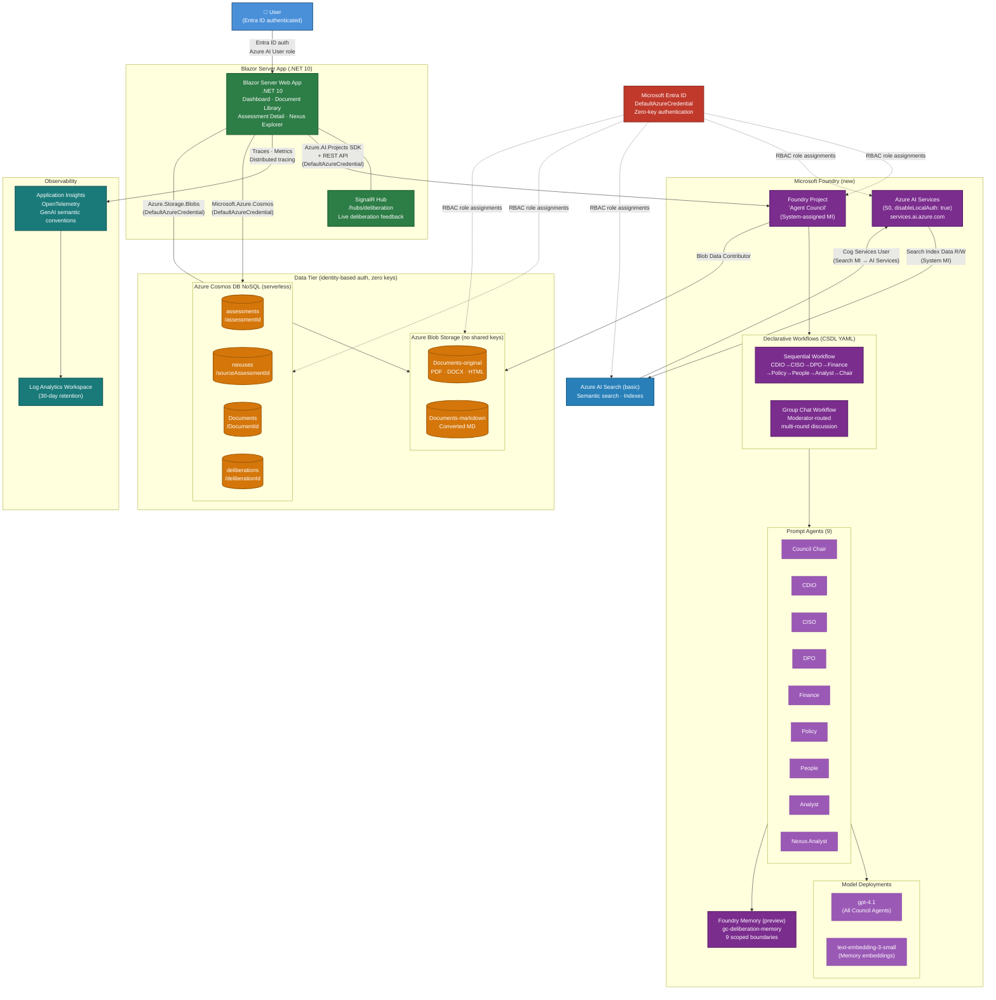
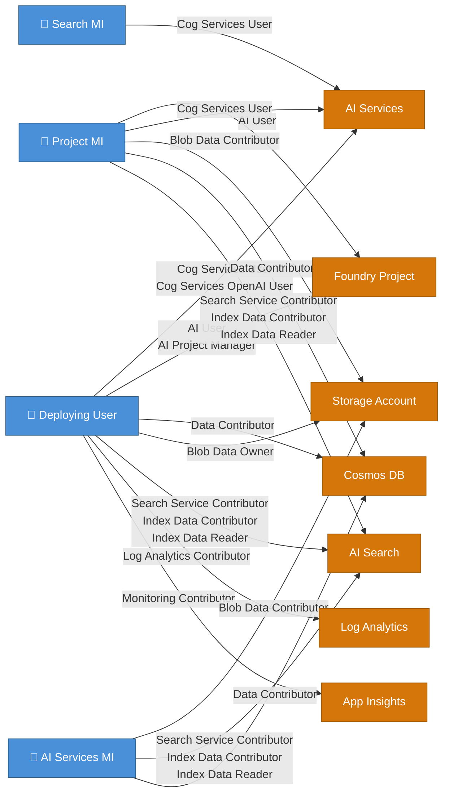
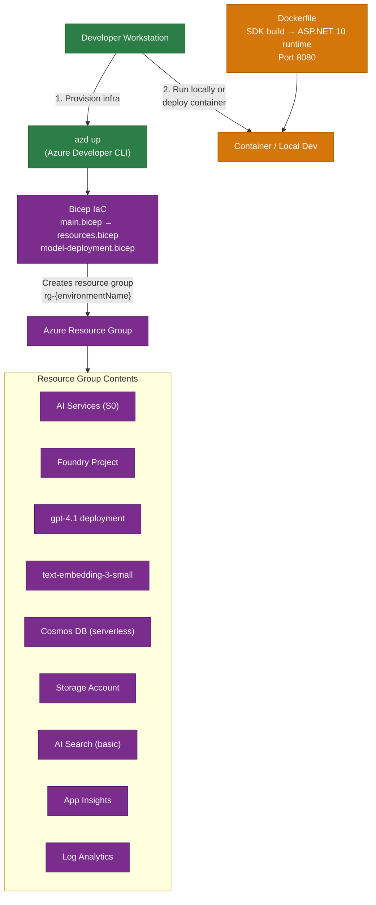
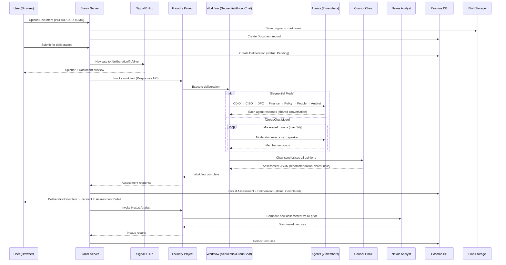

# Agent Council — Azure Architecture

## Overview

> **Deployment**: Blazor Server app running locally or in a container. Not yet deployed as a Foundry Hosted Agent. All Azure resources provisioned via Bicep (`azd up`). Zero keys — Entra ID + RBAC everywhere.

## Detailed Architecture

## RBAC Model

## Deployment Model

## Data Flow — Deliberation Lifecycle

